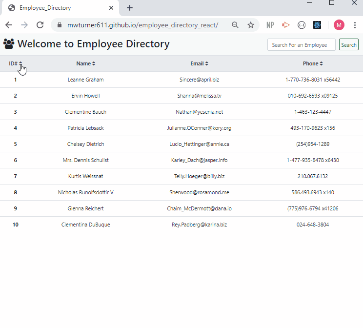

# employee_directory_react
###### Description

This React based application allows you to sort and search through an employee list generated from an axios call

## Technology
React.js, axios, react-router, JavaScript, and CSS.

# Demo

## Table of Contents
* [Top of Page](#description)
* [Technology](#tecknology)
* [Gif](#tecknology)
* [Usage](#usage)
* [Credits](#credits)
* [License](#license)
* [Contributing](#contributing)
* [Contacts](#contacts)

## Usage 
1. By default the main page will display all employee retrieved from an axios call 
2. You can sort the table of employees by any columns sort function
3. You can search for an employee by name in the search box

## Credits
Traversy Media's "React JS Crash Course" video.
Ishara Malaviarachchi's blog post "How to deploy your React app into Github Pages".

## License
This project is licensed under The MIT License.

## Contributing
All contributions and suggestions are welcome! For direct contributions, please fork the repository and file a pull request.

## Contacts

* Name: Matt Turner (mwturner611)
* e-mail: mwturner611@gmail.com
* [LinkedIn](https://www.linkedin.com/in/matt-turner-ba328211a/)